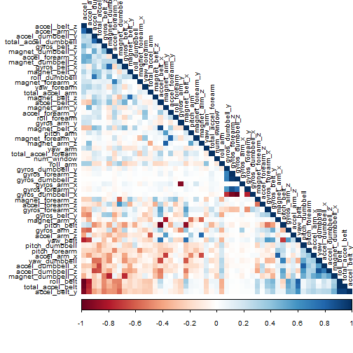
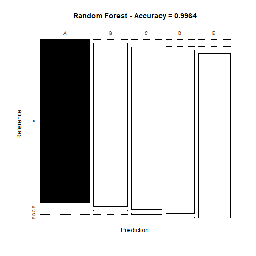
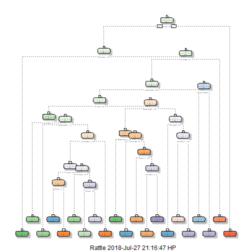
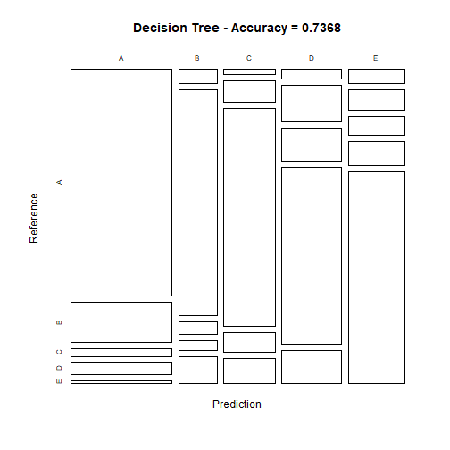
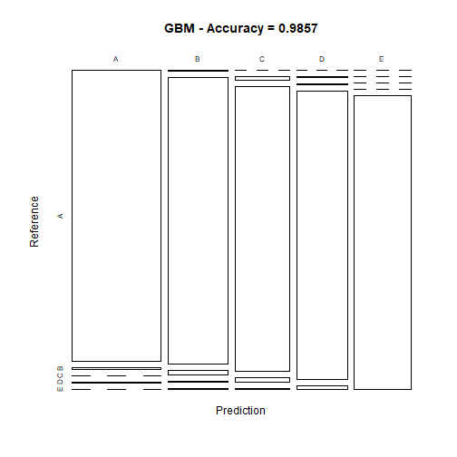

## I. Overview


This document is the final report of the Peer Assessment project from Coursera's Practical Machine Learning course, as part of Data Science Specialization.

This analysis is meant to be the basis for the course quiz and a prediction assignment writeup. The main goal of the project is to predict the manner in which 6 participants performed some exercise as described below. This is the "classe" variable in the training set. The machine learning algorithm described here is applied to the 20 test cases available in the test data and the predictions are submitted in appropriate format to the Course Project Prediction Quiz for automated grading.


## II. Background

Using devices such as Jawbone Up, Nike FuelBand, and Fitbit it is now possible to collect a large amount of data about personal activity relatively inexpensively. These type of devices are part of the quantified self movement - a group of enthusiasts who take measurements about themselves regularly to improve their health, to find patterns in their behavior, or because they are tech geeks. One thing that people regularly do is quantify how much of a particular activity they do, but they rarely quantify how well they do it. In this project, your goal will be to use data from accelerometers on the belt, forearm, arm, and dumbell of 6 participants. They were asked to perform barbell lifts correctly and incorrectly in 5 different ways. More information is available from the website here: http://groupware.les.inf.puc-rio.br/har (see the section on the Weight Lifting Exercise Dataset).


## III. Data Loading and Exploratory Analysis

### a) Dataset Overview

The training data for this project are available here:

https://d396qusza40orc.cloudfront.net/predmachlearn/pml-training.csv

The test data are available here:

https://d396qusza40orc.cloudfront.net/predmachlearn/pml-testing.csv

The data for this project come from http://groupware.les.inf.puc-rio.br/har.


### b) Environment Preparation

We first upload the R libraries that are necessary for the complete analysis.


```r
knitr::opts_chunk$set(echo = TRUE)
library(knitr)
library(caret)
library(rpart)
library(rpart.plot)
library(rattle)
library(randomForest)
library(corrplot)
set.seed(12345)
```


### c) Data Loading and Cleaning

The next step is loading the dataset from the URL provided above. The training dataset is then partitioned into 2 to create a Training set (70% of the data) for the modeling process and a Test set (with the remaining 30%) for the validations. This will allow us to estimate the out- of-sample error of our predictor.

The pml-testing dataset is not changed and will ONLY be used for the quiz results generation.


```r
# set the URL for the download
UrlTrain <- "http://d396qusza40orc.cloudfront.net/predmachlearn/pml-training.csv"
UrlTest  <- "http://d396qusza40orc.cloudfront.net/predmachlearn/pml-testing.csv"

# download the datasets
training <- read.csv(url(UrlTrain))
testing  <- read.csv(url(UrlTest))

# create a partition with the training dataset 
inTrain  <- createDataPartition(training$classe, p=0.7, list=FALSE)
TrainSet <- training[inTrain, ]
TestSet  <- training[-inTrain, ]
dim(TrainSet)
```

```
## [1] 13737   160
```

```r
dim(TestSet)
```

```
## [1] 5885  160
```


Both created datasets have 160 variables. Those variables have plenty of NA, that can be removed with the cleaning procedures below. The Near Zero variance (NZV) variables are also removed and the ID variables as well.


```r
# remove variables with Nearly Zero Variance
NZV <- nearZeroVar(TrainSet)
TrainSet <- TrainSet[, -NZV]
TestSet  <- TestSet[, -NZV]
dim(TrainSet)
```

```
## [1] 13737   106
```

```r
dim(TestSet)
```

```
## [1] 5885  106
```

```r
# remove variables that are mostly NAs
AllNA    <- sapply(TrainSet, function(x) mean(is.na(x))) > 0.95
TrainSet <- TrainSet[, AllNA==FALSE]
TestSet  <- TestSet[, AllNA==FALSE]
dim(TrainSet)
```

```
## [1] 13737    59
```

```r
dim(TestSet)
```

```
## [1] 5885   59
```

```r
# remove identification only variables (columns 1 to 5)
TrainSet <- TrainSet[, -(1:5)]
TestSet  <- TestSet[, -(1:5)]
dim(TrainSet)
```

```
## [1] 13737    54
```

With the cleaning process above, the number of variables for the analysis has been reduced to 54 only.


### d) Correlation Analysis

A correlation among variables is analysed before proceeding to the modeling procedures.


```r
corMatrix <- cor(TrainSet[, -54])
corrplot(corMatrix, order = "FPC", method = "color", type = "lower", 
         tl.cex = 0.8, tl.col = rgb(0, 0, 0))
```



The highly correlated variables are shown in dark colors in the graph above. To make an even more compact analysis, a PCA (Principal Components Analysis) could be performed as a pre-processing step to the datasets. Nevertheless, as the correlations are quite few, this step will not be applied for this assignment.


## IV. Prediction Model Building

Three methods will be applied to model the regressions (in the Train dataset) and the best one (with higher accuracy when applied to the Test dataset) will be used for the quiz predictions. The methods are: Random Forests, Decision Tree and Generalized Boosted Model, as described below.
A Confusion Matrix is plotted at the end of each analysis to better visualize the accuracy of the models.


### a) Method: Random Forest

Using random forest, the out of sample error should be small. The error will be estimated using the 30% testing sample. We should expect an error estimate of < 3%.


```r
# model fit
set.seed(12345)
controlRF <- trainControl(method="cv", number=3, verboseIter=FALSE)
modFitRandForest <- train(classe ~ ., data=TrainSet, method="rf",
                          trControl=controlRF)
modFitRandForest$finalModel
```

```
## 
## Call:
##  randomForest(x = x, y = y, mtry = param$mtry) 
##                Type of random forest: classification
##                      Number of trees: 500
## No. of variables tried at each split: 27
## 
##         OOB estimate of  error rate: 0.2%
## Confusion matrix:
##      A    B    C    D    E  class.error
## A 3904    1    0    0    1 0.0005120328
## B    6 2649    2    1    0 0.0033860045
## C    0    4 2391    1    0 0.0020868114
## D    0    0    7 2245    0 0.0031083481
## E    0    0    0    5 2520 0.0019801980
```

```r
# prediction on Test dataset
predictRandForest <- predict(modFitRandForest, newdata=TestSet)
confMatRandForest <- confusionMatrix(predictRandForest, TestSet$classe)
confMatRandForest
```

```
## Confusion Matrix and Statistics
## 
##           Reference
## Prediction    A    B    C    D    E
##          A 1674    5    0    0    0
##          B    0 1133    4    0    0
##          C    0    1 1022    7    0
##          D    0    0    0  957    4
##          E    0    0    0    0 1078
## 
## Overall Statistics
##                                           
##                Accuracy : 0.9964          
##                  95% CI : (0.9946, 0.9978)
##     No Information Rate : 0.2845          
##     P-Value [Acc > NIR] : < 2.2e-16       
##                                           
##                   Kappa : 0.9955          
##  Mcnemar's Test P-Value : NA              
## 
## Statistics by Class:
## 
##                      Class: A Class: B Class: C Class: D Class: E
## Sensitivity            1.0000   0.9947   0.9961   0.9927   0.9963
## Specificity            0.9988   0.9992   0.9984   0.9992   1.0000
## Pos Pred Value         0.9970   0.9965   0.9922   0.9958   1.0000
## Neg Pred Value         1.0000   0.9987   0.9992   0.9986   0.9992
## Prevalence             0.2845   0.1935   0.1743   0.1638   0.1839
## Detection Rate         0.2845   0.1925   0.1737   0.1626   0.1832
## Detection Prevalence   0.2853   0.1932   0.1750   0.1633   0.1832
## Balanced Accuracy      0.9994   0.9969   0.9972   0.9960   0.9982
```

```r
# plot matrix results
plot(confMatRandForest$table, col = confMatRandForest$byClass, 
     main = paste("Random Forest - Accuracy =",
                  round(confMatRandForest$overall['Accuracy'], 4)))
```




### b) Method: Decision Trees


```r
# model fit
set.seed(12345)
modFitDecTree <- rpart(classe ~ ., data=TrainSet, method="class")
fancyRpartPlot(modFitDecTree)
```

```
## Warning: labs do not fit even at cex 0.15, there may be some overplotting
```



```r
# prediction on Test dataset
predictDecTree <- predict(modFitDecTree, newdata=TestSet, type="class")
confMatDecTree <- confusionMatrix(predictDecTree, TestSet$classe)
confMatDecTree
```

```
## Confusion Matrix and Statistics
## 
##           Reference
## Prediction    A    B    C    D    E
##          A 1530  269   51   79   16
##          B   35  575   31   25   68
##          C   17   73  743   68   84
##          D   39  146  130  702  128
##          E   53   76   71   90  786
## 
## Overall Statistics
##                                          
##                Accuracy : 0.7368         
##                  95% CI : (0.7253, 0.748)
##     No Information Rate : 0.2845         
##     P-Value [Acc > NIR] : < 2.2e-16      
##                                          
##                   Kappa : 0.6656         
##  Mcnemar's Test P-Value : < 2.2e-16      
## 
## Statistics by Class:
## 
##                      Class: A Class: B Class: C Class: D Class: E
## Sensitivity            0.9140  0.50483   0.7242   0.7282   0.7264
## Specificity            0.9014  0.96650   0.9502   0.9100   0.9396
## Pos Pred Value         0.7866  0.78338   0.7543   0.6131   0.7305
## Neg Pred Value         0.9635  0.89051   0.9422   0.9447   0.9384
## Prevalence             0.2845  0.19354   0.1743   0.1638   0.1839
## Detection Rate         0.2600  0.09771   0.1263   0.1193   0.1336
## Detection Prevalence   0.3305  0.12472   0.1674   0.1946   0.1828
## Balanced Accuracy      0.9077  0.73566   0.8372   0.8191   0.8330
```

```r
# plot matrix results
plot(confMatDecTree$table, col = confMatDecTree$byClass, 
     main = paste("Decision Tree - Accuracy =",
                  round(confMatDecTree$overall['Accuracy'], 4)))
```




### c) Method: Generalized Boosted Model


```r
# model fit
set.seed(12345)
controlGBM <- trainControl(method = "repeatedcv", number = 5, repeats = 1)
modFitGBM  <- train(classe ~ ., data=TrainSet, method = "gbm",
                    trControl = controlGBM, verbose = FALSE)
modFitGBM$finalModel
```

```
## A gradient boosted model with multinomial loss function.
## 150 iterations were performed.
## There were 53 predictors of which 41 had non-zero influence.
```

```r
# prediction on Test dataset
predictGBM <- predict(modFitGBM, newdata=TestSet)
confMatGBM <- confusionMatrix(predictGBM, TestSet$classe)
confMatGBM
```

```
## Confusion Matrix and Statistics
## 
##           Reference
## Prediction    A    B    C    D    E
##          A 1670   11    0    2    0
##          B    4 1115   16    5    2
##          C    0   12 1006   16    1
##          D    0    1    4  941   10
##          E    0    0    0    0 1069
## 
## Overall Statistics
##                                           
##                Accuracy : 0.9857          
##                  95% CI : (0.9824, 0.9886)
##     No Information Rate : 0.2845          
##     P-Value [Acc > NIR] : < 2.2e-16       
##                                           
##                   Kappa : 0.9819          
##  Mcnemar's Test P-Value : NA              
## 
## Statistics by Class:
## 
##                      Class: A Class: B Class: C Class: D Class: E
## Sensitivity            0.9976   0.9789   0.9805   0.9761   0.9880
## Specificity            0.9969   0.9943   0.9940   0.9970   1.0000
## Pos Pred Value         0.9923   0.9764   0.9720   0.9843   1.0000
## Neg Pred Value         0.9990   0.9949   0.9959   0.9953   0.9973
## Prevalence             0.2845   0.1935   0.1743   0.1638   0.1839
## Detection Rate         0.2838   0.1895   0.1709   0.1599   0.1816
## Detection Prevalence   0.2860   0.1941   0.1759   0.1624   0.1816
## Balanced Accuracy      0.9973   0.9866   0.9873   0.9865   0.9940
```

```r
# plot matrix results
plot(confMatGBM$table, col = confMatGBM$byClass, 
     main = paste("GBM - Accuracy =", round(confMatGBM$overall['Accuracy'], 4)))
```




## V. Applying the Selected Model to the Test Data


The accuracy of the 3 regression modeling methods above are:

Random Forest : 0.9963
Decision Tree : 0.7368
GBM : 0.9839


In that case, the Random Forest model will be applied to predict the 20 quiz results (testing dataset) as shown below.


```r
predictTEST <- predict(modFitRandForest, newdata=testing)
predictTEST
```

```
##  [1] B A B A A E D B A A B C B A E E A B B B
## Levels: A B C D E
```


